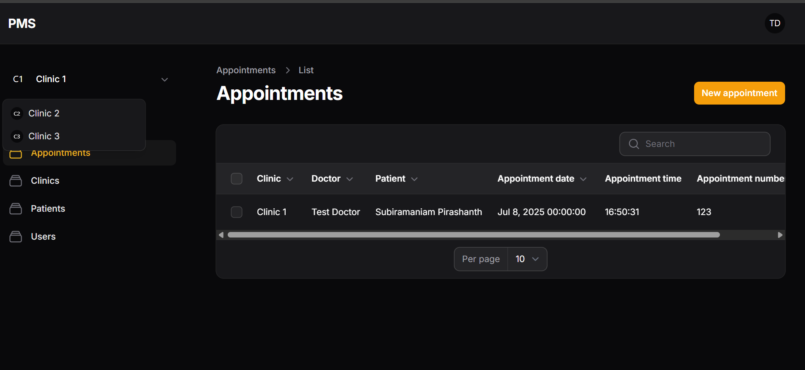
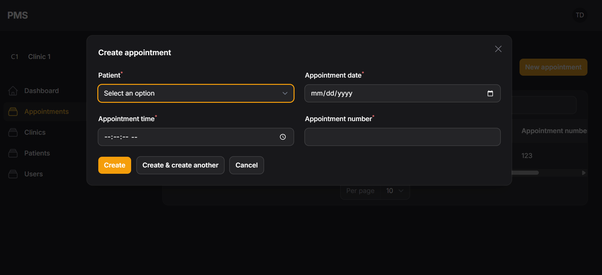

# 🏥 Laravel 12 + FilamentPHP v3 Multi-Tenant Patient Management

A simple multi-tenant patient management system built with **Laravel 12** and **FilamentPHP v3**. Each clinic (tenant) can only access its own data using Filament’s built-in multi-tenancy support.

## 🎯 Goal

Build a SaaS-style app where clinics manage their patients securely and independently.

## 💡 Key Concepts

- Multi-tenancy with clinic-level data isolation
- Scoped Filament resources
- Secure and scalable app structure

## 🛠️ Tech Stack

- Laravel 12
- FilamentPHP v3
- Tailwind CSS + Livewire
- Optional: Spatie Multitenancy

## ✅ Features

- Tenant login (clinic admins)
- Clinic-specific patient management
- Scoped admin panels per clinic
## 📸 Screenshots

### 🔹 Clinic Dashboard

### 🔹 Patient Management View

---
